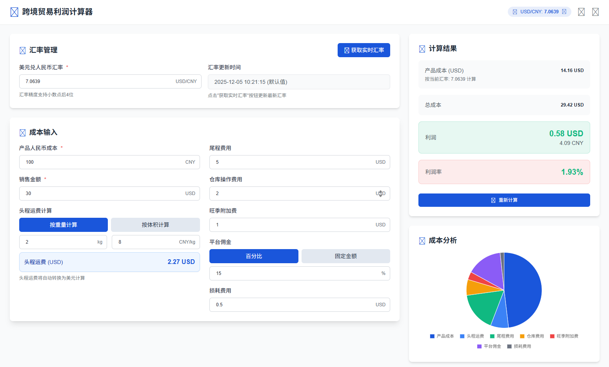
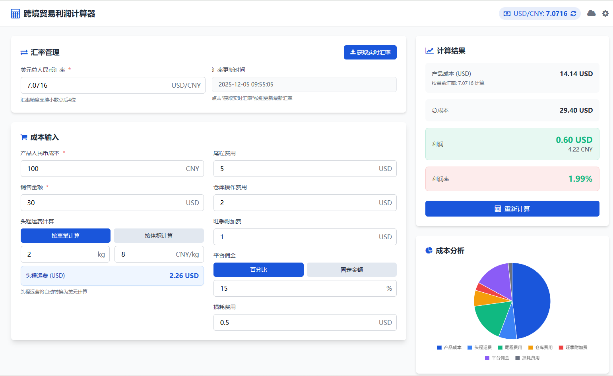

# 跨境贸易利润计算器

一个全面的跨境电商利润计算Web应用程序，具有实时汇率、成本计算和数据持久化功能。

A comprehensive web application for calculating profits in cross-border e-commerce, featuring real-time exchange rates, cost calculations, and data persistence.

## 功能特性 / Features

- 实时USD/CNY汇率获取 / Real-time USD/CNY exchange rate fetching
- 全面的成本计算，包括运费、仓储和平台费用 / Comprehensive cost calculation including shipping, warehousing, and platform fees
- 使用本地存储和Cloudflare KV的数据持久化 / Data persistence with local storage and Cloudflare KV
- 响应式设计，支持桌面和移动设备 / Responsive design for desktop and mobile devices
- 导出Excel和PDF格式的功能 / Export functionality to Excel and PDF formats
- 数据共享功能 / Data sharing capabilities

## 界面预览 / Interface Preview

以下是我们应用程序的界面截图：

<div align="center">
  <figure>
    
    <figcaption>利润计算界面示例1</figcaption>
  </figure>
  
  <figure>
    
    <figcaption>利润计算界面示例2</figcaption>
  </figure>
</div>

## 项目结构 / Project Structure

```
.
├── deploy/
├── img/
│   ├── zh/  (中文界面截图) / (Chinese interface screenshots)
│   └── en/  (英文界面截图) / (English interface screenshots)
├── pages/  (前端页面) / (Frontend pages)
├── worker/  (后端Worker) / (Backend Worker)
├── ORANGE_CLOUD_DEPLOYMENT.md  (橙云部署指南) / (Orange Cloud deployment guide)
├── DEPLOYMENT_INSTRUCTIONS.md  (详细部署说明) / (Detailed deployment instructions)
├── README.md  (本文档) / (This document)
└── README_EN.md  (英文文档) / (English documentation)
```

## 快速开始 / Quick Start

### 前置准备 / Prerequisites

1. 注册Cloudflare账号：https://dash.cloudflare.com/ / Cloudflare account: https://dash.cloudflare.com/
2. 获取Fixer API Key：https://apilayer.com/marketplace/fixer-api / Fixer API Key: https://apilayer.com/marketplace/fixer-api
3. 安装Node.js和Wrangler CLI： / Node.js and Wrangler CLI:
   ```bash
   npm install -g wrangler
   wrangler login # 登录Cloudflare账号 / Login to your Cloudflare account
   ```

### 本地开发 / Local Development

```bash
# 运行Cloudflare Worker本地调试 / Run Cloudflare Worker locally
cd worker
wrangler dev

# 或者使用npm脚本 / Or use npm scripts
npm run dev
```

## 部署到橙云 / Deploy to Orange Cloud

请参考 [DEPLOYMENT_INSTRUCTIONS.md](DEPLOYMENT_INSTRUCTIONS.md) 文件获取详细的中英文部署说明。

Please refer to [DEPLOYMENT_INSTRUCTIONS.md](DEPLOYMENT_INSTRUCTIONS.md) for detailed deployment instructions in Chinese and English.

## 测试KV功能 / Testing KV Functionality

在本地开发模式下运行Worker后，可以使用提供的测试脚本验证KV功能：

After running the Worker in local development mode, you can test KV functionality with the provided test script:

```bash
node test_kv.js
```

## 贡献 / Contributing

欢迎贡献！请随时提交Pull Request。

Contributions are welcome! Please feel free to submit a Pull Request.

## 许可证 / License

本项目采用MIT许可证 - 详情请见 [LICENSE](LICENSE) 文件。

This project is licensed under the MIT License - see the [LICENSE](LICENSE) file for details.
